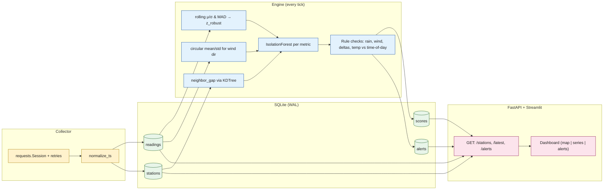

```mermaid
%%{init: {"flowchart": {"htmlLabels": false}} }%%
flowchart LR
  %% Ingestion
  subgraph COLLECTOR["Collector"]
    A["requests.Session + retries"]
    B["normalize_ts"]
    A --> B
  end

  %% Storage
  subgraph STORE["SQLite (WAL)"]
    R[(readings)]
    S[(stations)]
    C[(scores)]
    L[(alerts)]
  end

  %% Processing
  subgraph ENGINE["Engine (every tick)"]
    F1["rolling μ/σ & MAD → z_robust"]
    F2["circular mean/std for wind dir"]
    F3["neighbor_gap via KDTree"]
    M1["IsolationForest per metric"]
    RL["Rule checks: rain, wind, deltas, temp vs time-of-day"]
  end

  %% API/UI
  subgraph APIUI["FastAPI + Streamlit"]
    API["GET: /stations, /latest, /alerts"]
    UI["Dashboard (map | series | alerts)"]
  end

  B --> R
  B --> S
  R --> F1
  R --> F2
  S --> F3
  F1 --> M1
  F2 --> M1
  F3 --> M1
  M1 --> RL
  RL --> C
  RL --> L
  S --> API
  R --> API
  C --> API
  L --> API
  API --> UI

  %% Styling 
  classDef collector fill:#FFF2CC,stroke:#A67C00,color:#222,stroke-width:1px;
  classDef store     fill:#E8F5E9,stroke:#1B5E20,color:#222,stroke-width:1px;
  classDef engine    fill:#E3F2FD,stroke:#0D47A1,color:#222,stroke-width:1px;
  classDef api       fill:#FCE4EC,stroke:#880E4F,color:#222,stroke-width:1px;

  class A,B collector;
  class R,S,C,L store;
  class F1,F2,F3,M1,RL engine;
  class API,UI api;

```