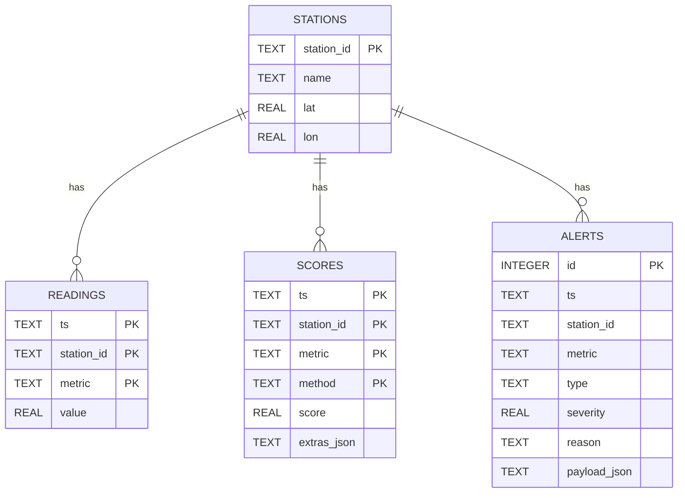

```mermaid
erDiagram
  STATIONS {
    TEXT station_id PK
    TEXT name
    REAL lat
    REAL lon
  }

  READINGS {
    TEXT ts PK
    TEXT station_id PK
    TEXT metric PK
    REAL value
  }

  SCORES {
    TEXT ts PK
    TEXT station_id PK
    TEXT metric PK
    TEXT method PK
    REAL score
    TEXT extras_json
  }

  ALERTS {
    INTEGER id PK
    TEXT ts
    TEXT station_id
    TEXT metric
    TEXT type
    REAL severity
    TEXT reason
    TEXT payload_json
  }

  STATIONS ||--o{ READINGS : has
  STATIONS ||--o{ SCORES   : has
  STATIONS ||--o{ ALERTS   : has

```